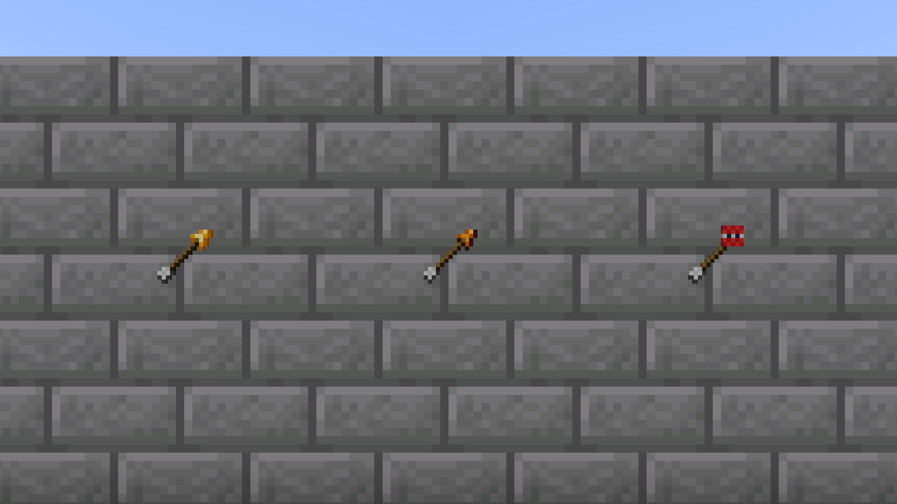
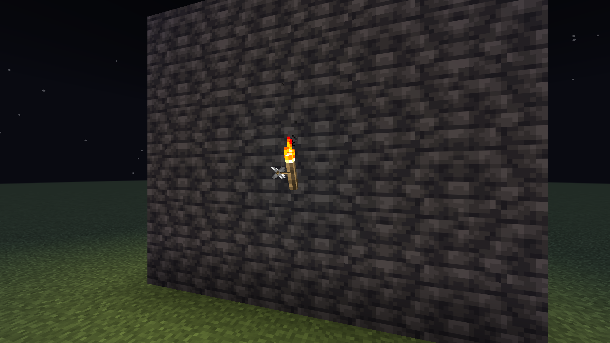
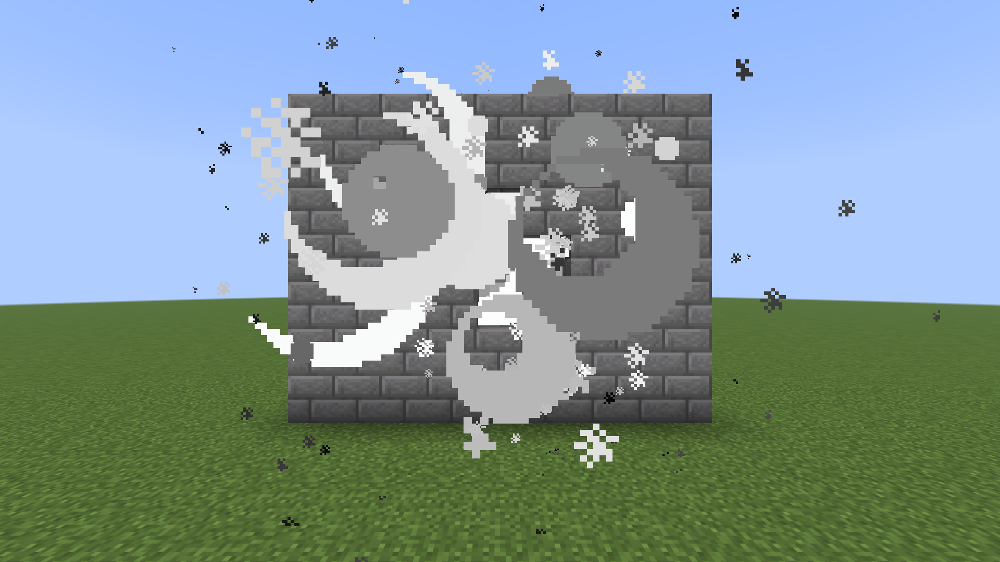
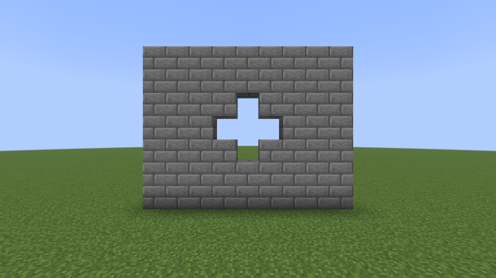

# Fire Arrows

A [Minecraft](https://minecraft.net) mod built on [Fabric](https://fabricmc.net) that adds three arrows that carry something to where they land.

## Screenshots

| Arrow | Crafted from | Where it lands |
|-------|--------------|----------------|
| **Torch Arrow** | an arrow and a torch | Sets a torch on the face it strikes: standing on a top, fixed to a side |
| **Fire Arrow** (4) | four arrows and a fire charge | Flies burning: sets what it hits alight, and lights TNT, candles and campfires it strikes |
| **Explosive Arrow** (4) | four arrows and a block of TNT | Goes off at whatever it strikes, with less than TNT's force |

They are ammunition like any other arrow: a bow draws them, a crossbow loads them, a dispenser fires them.

## Where they land

- **A torch arrow** leaves its torch on the block it hits. Where a torch cannot go - a ceiling, water, ground the shooter may not build on - the torch drops there instead. The arrow itself is left stuck in the block and picks up as a plain arrow.
- **A fire arrow** is an arrow on fire, the same as one from a bow with Flame, so everything the game already does with a burning arrow it does: a mob or player it hits burns, TNT it strikes is lit, a candle or campfire catches. Water and rain put it out. Once it lands it is a plain arrow to pick up, the charge spent.
- **An explosive arrow** explodes where it hits, block or creature, and is gone. Under TNT's force: it takes a bite out of a wall rather than a room out of a house. The shooter is who the explosion answers to.

## At the fletching table

With [Fletch Craft](../fletch-craft) installed, the fletching table makes them too:

- three torches over three arrows: three torch arrows
- a fire charge set among five arrows: five fire arrows, one more than the crafting table gives
- a block of TNT set among five arrows: five explosive arrows

## Settings

On the Fire Arrows page of the Pandorical mods menu, for ops, and in `config/fire-arrows.json`:

| Setting | Default | |
|---------|---------|---|
| Explosive arrows break blocks (`explosiveBreaksBlocks`) | on | Off, an explosive arrow still hurts what it hits and leaves the ground as it was |

## Pandorical

Fire Arrows runs on the server, and Pandorical is required: it delivers the three items, their names and their pictures to every client that joins. In flight each is the game's own arrow, so it is drawn the way any arrow is.

## Development

Installing and building are in [DEVELOPMENT.md](DEVELOPMENT.md).

## License

MIT, see [LICENSE](LICENSE).
